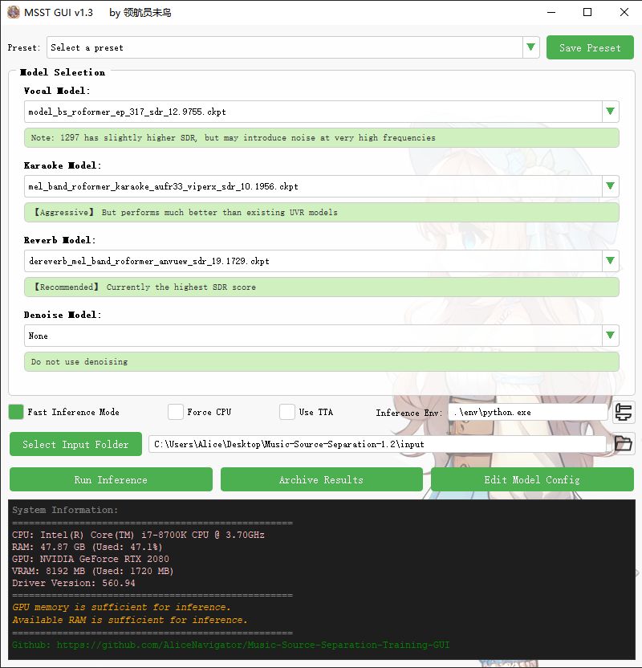
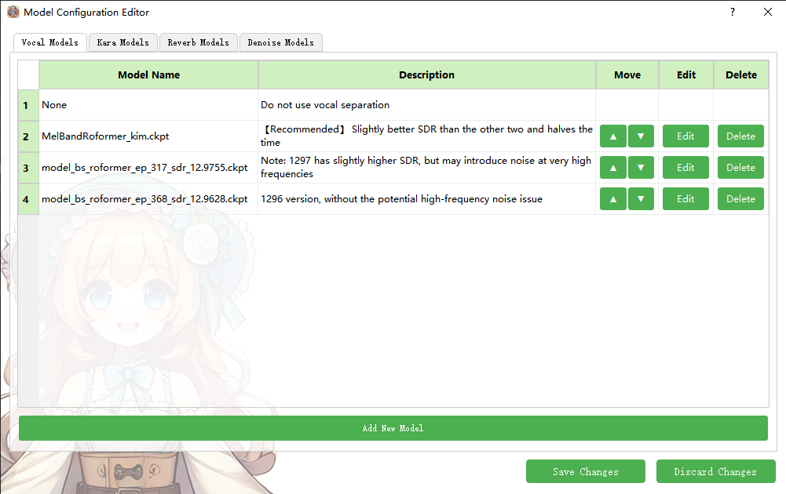

## Introduction

MSST-GUI is a Qt5-based inference GUI, designed to provide a convenient and intuitive way to inference (mainly for my own use). At its core, it's a GUI that uses a specified Python environment to add parameters and call `inference.py`. As such, you can also package `msst_gui_en.py` as a smaller executable file and use it in the main repository.[You can find it here.](https://github.com/AliceNavigator/Music-Source-Separation-Training-GUI/releases/tag/v1.3.0)




Inferences are executed sequentially on the target audio from top to bottom. For example, enabling Vocal Model, Karaoke Model, and Reverb Model for a song will directly yield the dry main vocal. Hover your mouse over the corresponding areas to see explanatory information.



MSST-GUI also comes equipped with a configuration editor, allowing you to add and use your own models or edit existing ones. Models should be placed in the `pretrain` directory.

## Installation

1. Clone this repository:
   ```
   git clone https://github.com/AliceNavigator/Music-Source-Separation-Training-GUI.git
   ```
2. Install the required dependencies:
   ```
   pip install -r requirements.txt
   ```

## Usage

For English users:
```
python msst_gui_en.py
```

For Chinese users:
```
python msst_gui_zh.py
```


